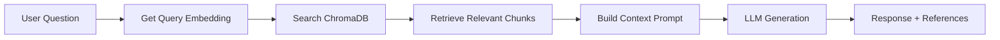
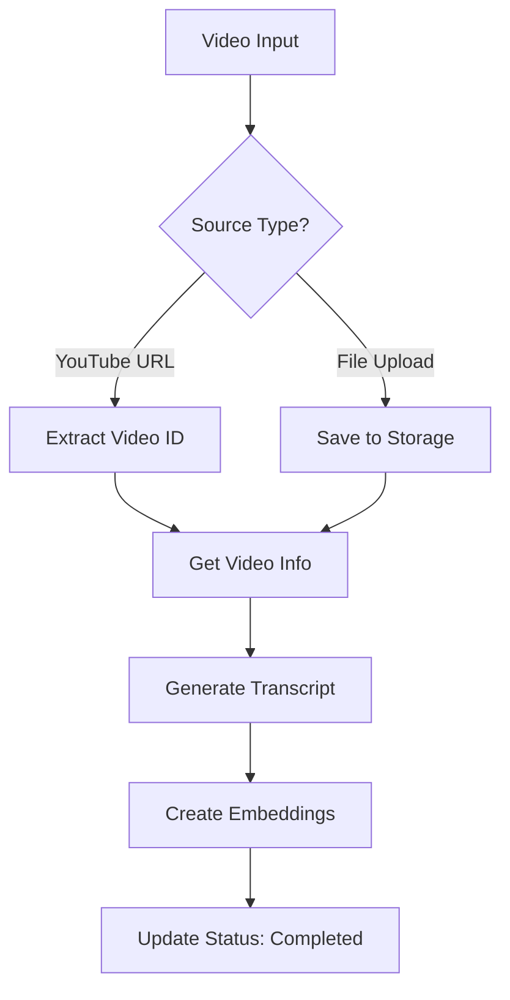

# Backend Documentation

A comprehensive guide to the Video-RAG Backend built with FastAPI.

---

## Table of Contents

1. [Overview](#overview)
2. [Tech Stack](#tech-stack)
3. [Project Structure](#project-structure)
4. [Core Components](#core-components)
5. [API Endpoints](#api-endpoints)
6. [Services](#services)
7. [Database Models](#database-models)
8. [Configuration](#configuration)
9. [Running the Server](#running-the-server)

---

## Overview

The backend is a **FastAPI-based REST API** that powers the Video-RAG (Retrieval Augmented Generation) application. It provides:

- Video processing (YouTube URLs & file uploads)
- Audio transcription using OpenAI Whisper
- RAG-powered AI chat using ChromaDB + LLMs
- AI-generated quizzes based on video content
- Semantic search across video transcripts

---

## Tech Stack

| Technology | Version | Purpose |
|------------|---------|---------|
| **FastAPI** | 0.128.0 | Modern async web framework |
| **SQLAlchemy** | 2.0.45 | ORM for database operations |
| **ChromaDB** | 1.4.1 | Vector database for RAG embeddings |
| **OpenAI Whisper** | 20250625 | Audio transcription |
| **Google Generative AI** | 0.8.6 | LLM for chat & quiz generation |
| **OpenAI API** | 2.15.0 | Alternative LLM provider |
| **Alembic** | 1.18.1 | Database migrations |
| **yt-dlp** | 2025.12.8 | YouTube video downloading |
| **Pydantic** | 2.12.5 | Data validation & serialization |
| **SlowAPI** | 0.1.9 | Rate limiting |
| **Uvicorn** | 0.40.0 | ASGI server |

---

## Project Structure

```
backend/
├── app/
│   ├── __init__.py
│   ├── config.py           # Settings and configuration
│   ├── database.py         # Database connection setup
│   ├── main.py             # FastAPI app entry point
│   │
│   ├── models/             # SQLAlchemy ORM models
│   │   ├── __init__.py
│   │   ├── video.py        # Video model
│   │   ├── chat.py         # ChatMessage model
│   │   ├── quiz.py         # Quiz & QuizResult models
│   │   └── note.py         # Note model
│   │
│   ├── routers/            # API route handlers
│   │   ├── __init__.py
│   │   ├── videos.py       # /api/videos endpoints
│   │   ├── chat.py         # /api/chat endpoints
│   │   ├── quiz.py         # /api/quiz endpoints
│   │   ├── search.py       # /api/search endpoints
│   │   └── notes.py        # /api/notes endpoints
│   │
│   ├── schemas/            # Pydantic request/response schemas
│   │   └── *.py
│   │
│   └── services/           # Business logic
│       ├── __init__.py
│       ├── video_processor.py  # Video download & transcription
│       ├── rag_service.py      # RAG chat functionality
│       └── quiz_service.py     # Quiz generation
│
├── alembic/                # Database migrations
├── tests/                  # Test files
├── requirements.txt        # Python dependencies
└── .env.example            # Environment template
```

---

## Core Components

### 1. Main Application (`main.py`)

The entry point that configures:

- **CORS Middleware** - Allows frontend origins (`localhost:5173`, `5174`, `3000`)
- **Rate Limiting** - 100 requests/minute per IP using SlowAPI
- **Exception Handlers** - Global error handling for validation and unexpected errors
- **Router Registration** - All API routes under `/api` prefix

```python
app = FastAPI(
    title="Video-RAG API",
    description="Backend API for Video-RAG application",
    version="1.0.0"
)
```

### 2. Configuration (`config.py`)

Uses `pydantic-settings` for environment-based configuration:

| Variable | Description |
|----------|-------------|
| `DATABASE_URL` | SQLite/PostgreSQL connection string |
| `GOOGLE_API_KEY` | Google Gemini API key (preferred) |
| `OPENAI_API_KEY` | OpenAI API key (fallback) |
| `CHROMA_PERSIST_DIR` | ChromaDB storage path |

### 3. Database (`database.py`)

SQLAlchemy setup with session management:

```python
engine = create_engine(DATABASE_URL)
SessionLocal = sessionmaker(bind=engine)
```

---

## API Endpoints

### Videos API (`/api/videos`)

| Method | Endpoint | Description |
|--------|----------|-------------|
| `GET` | `/videos` | List all videos |
| `GET` | `/videos/{id}` | Get video details |
| `POST` | `/videos/process-url` | Process YouTube URL |
| `POST` | `/videos/upload` | Upload video file |
| `GET` | `/videos/{id}/status` | Get processing status |
| `POST` | `/videos/{id}/like` | Toggle like status |
| `DELETE` | `/videos/{id}` | Delete video |
| `GET` | `/videos/{id}/transcript` | Get transcript |
| `GET` | `/videos/{id}/notes` | Get notes for video |
| `POST` | `/videos/{id}/notes` | Create a note |
| `DELETE` | `/videos/{id}/notes/{noteId}` | Delete a note |

### Chat API (`/api/chat`)

| Method | Endpoint | Description |
|--------|----------|-------------|
| `POST` | `/chat` | Send message to AI (RAG) |
| `GET` | `/chat/{videoId}/history` | Get chat history |
| `DELETE` | `/chat/{videoId}/history` | Clear chat history |

### Quiz API (`/api/quiz`)

| Method | Endpoint | Description |
|--------|----------|-------------|
| `POST` | `/quiz/generate` | Generate quiz from video |
| `GET` | `/quiz/{quizId}` | Get quiz by ID |
| `POST` | `/quiz/{quizId}/submit` | Submit quiz answers |
| `GET` | `/quiz/{quizId}/results` | Get quiz analysis |

### Search API (`/api/search`)

| Method | Endpoint | Description |
|--------|----------|-------------|
| `POST` | `/search` | Semantic search across videos |
| `GET` | `/search/suggestions` | Get search suggestions |

---

## Services

### RAG Service (`rag_service.py`)

Implements Retrieval Augmented Generation:



**Key Functions:**

| Function | Description |
|----------|-------------|
| `chunk_text()` | Splits transcript into overlapping chunks |
| `get_embeddings()` | Creates vector embeddings using Google/OpenAI |
| `add_video_to_index()` | Indexes video chunks in ChromaDB |
| `search_similar_chunks()` | Semantic search in vector DB |
| `get_rag_response()` | Full RAG pipeline for chat |
| `generate_llm_response()` | Direct LLM generation |

### Video Processor (`video_processor.py`)

Handles video processing pipeline:



### Quiz Service (`quiz_service.py`)

AI-powered quiz generation:

- Uses LLM to generate multiple-choice questions
- Parses JSON response from AI
- Analyzes results and provides feedback
- Identifies knowledge gaps based on incorrect answers

---

## Database Models

### Video Model

```python
class Video:
    id: str              # UUID primary key
    title: str           # Video title
    url: str             # Source URL
    file_path: str       # Local file path (if uploaded)
    duration: int        # Duration in seconds
    transcript: str      # Full transcript text
    status: VideoStatus  # PENDING, PROCESSING, COMPLETED, FAILED
    progress: int        # 0-100 processing progress
    is_liked: bool       # User like status
    created_at: datetime
```

### Quiz Model

```python
class Quiz:
    id: str
    video_id: str
    questions: JSON      # Array of question objects
    created_at: datetime

class QuizResult:
    id: str
    quiz_id: str
    answers: JSON        # User's answers
    score: int
    total: int
    analysis: str        # AI-generated feedback
```

### ChatMessage Model

```python
class ChatMessage:
    id: str
    video_id: str
    role: str            # "user" or "assistant"
    content: str
    references: JSON     # Timestamp references
    created_at: datetime
```

---

## Configuration

### Environment Variables

Create `.env` from `.env.example`:

```env
# Database
DATABASE_URL=sqlite:///./videorag.db

# AI Provider (choose one or both)
GOOGLE_API_KEY=your-google-api-key
OPENAI_API_KEY=your-openai-api-key

# Optional
DEBUG=true
CHROMA_PERSIST_DIR=./chroma_db
```

---

## Running the Server

```bash
# Navigate to backend directory
cd backend

# Create virtual environment
python -m venv venv
source venv/bin/activate  # Windows: venv\Scripts\activate

# Install dependencies
pip install -r requirements.txt

# Set up environment
cp .env.example .env
# Edit .env and add your API keys

# Run development server
uvicorn app.main:app --reload --port 8000

# Access API docs
open http://localhost:8000/docs
```

### API Documentation

- **Swagger UI**: http://localhost:8000/docs
- **ReDoc**: http://localhost:8000/redoc
- **Health Check**: http://localhost:8000/health

---

## Error Handling

The backend uses structured error responses:

```json
{
    "error": "Error Type",
    "message": "Human readable message",
    "details": []  // Optional validation details
}
```

Common HTTP status codes:
- `200` - Success
- `201` - Created
- `400` - Bad Request
- `404` - Not Found
- `422` - Validation Error
- `429` - Rate Limited
- `500` - Server Error
