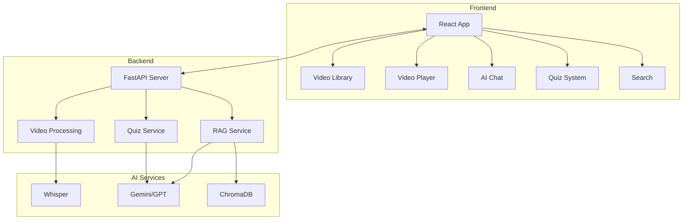
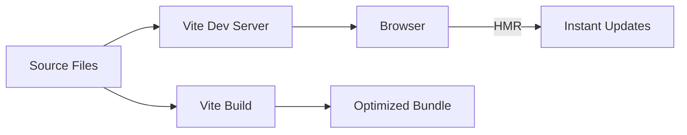
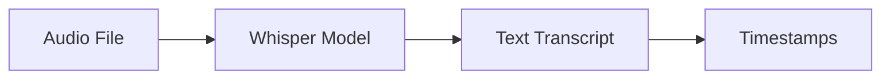
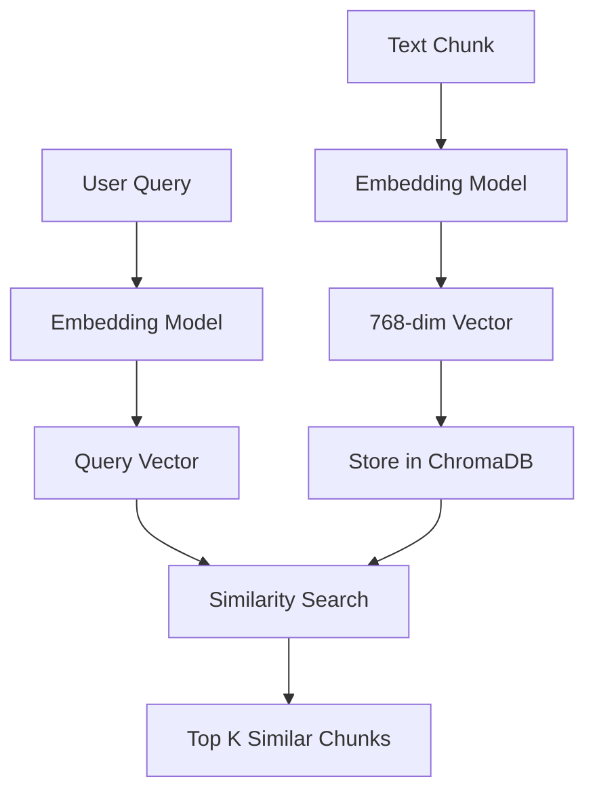
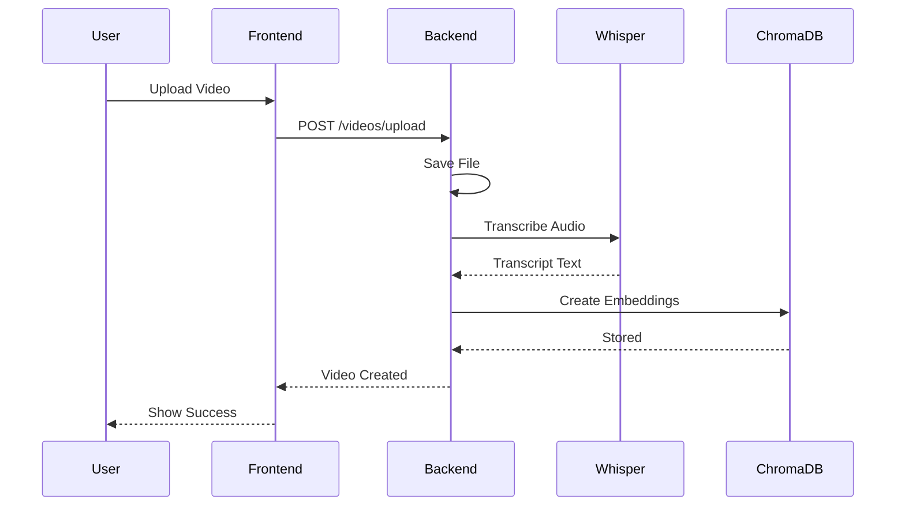
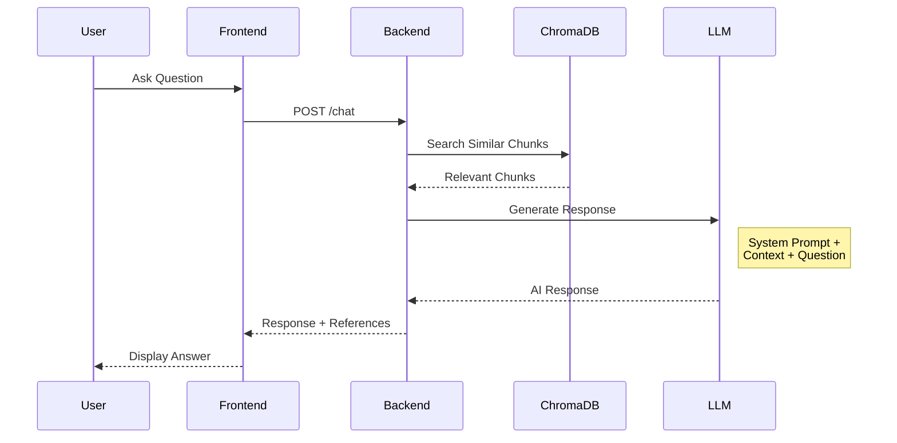
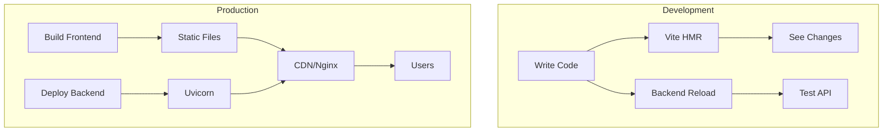

# Technology Guide & Architecture

A comprehensive guide explaining all technologies used in the Video-RAG application, their purposes, and how they work together.

---

## Table of Contents

1. [Application Overview](#application-overview)
2. [System Architecture](#system-architecture)
3. [Frontend Technologies](#frontend-technologies)
4. [Backend Technologies](#backend-technologies)
5. [AI/ML Technologies](#aiml-technologies)
6. [Data Flow](#data-flow)
7. [Key Concepts Explained](#key-concepts-explained)
8. [Development Workflow](#development-workflow)

---

## Application Overview

**Video-RAG** is a full-stack web application that combines:

- **Video Processing** - Handle YouTube URLs and file uploads
- **AI Transcription** - Convert audio to text using Whisper
- **RAG Chat** - Answer questions about video content
- **Quiz Generation** - Create AI-powered quizzes
- **Semantic Search** - Find content across videos



---

## System Architecture

### Three-Tier Architecture

```
┌─────────────────────────────────────────────────────────────────┐
│                     PRESENTATION TIER                           │
│  ┌──────────────────────────────────────────────────────────┐   │
│  │  React 19 + Vite + TailwindCSS                           │   │
│  │  - Single Page Application (SPA)                         │   │
│  │  - Client-side Routing (React Router)                    │   │
│  │  - Context API for State Management                      │   │
│  └──────────────────────────────────────────────────────────┘   │
└─────────────────────────────────────────────────────────────────┘
                              │
                              │ HTTP/REST API
                              ▼
┌─────────────────────────────────────────────────────────────────┐
│                      APPLICATION TIER                           │
│  ┌──────────────────────────────────────────────────────────┐   │
│  │  FastAPI + Python                                        │   │
│  │  - REST API Endpoints                                    │   │
│  │  - Business Logic (Services)                             │   │
│  │  - Data Validation (Pydantic)                            │   │
│  └──────────────────────────────────────────────────────────┘   │
└─────────────────────────────────────────────────────────────────┘
                              │
                              │ SQL + Vector Queries
                              ▼
┌─────────────────────────────────────────────────────────────────┐
│                        DATA TIER                                │
│  ┌─────────────────────┐  ┌────────────────────────────────┐   │
│  │  SQLite/PostgreSQL  │  │  ChromaDB (Vector Database)    │   │
│  │  - Videos           │  │  - Embeddings                   │   │
│  │  - Quizzes          │  │  - Semantic Search              │   │
│  │  - Chat History     │  │  - RAG Context                  │   │
│  └─────────────────────┘  └────────────────────────────────┘   │
└─────────────────────────────────────────────────────────────────┘
```

---

## Frontend Technologies

### 1. React 19

**What it is:** A JavaScript library for building user interfaces.

**Why we use it:**
- Component-based architecture
- Virtual DOM for efficient updates
- Huge ecosystem and community
- Hooks for state management

**Key Concepts:**

```jsx
// Components - Reusable UI pieces
function VideoCard({ video }) {
  return <div>{video.title}</div>;
}

// Hooks - State and side effects
const [videos, setVideos] = useState([]);
useEffect(() => {
  fetchVideos();
}, []);

// Context - Global state sharing
const { theme } = useContext(ThemeContext);
```

---

### 2. Vite

**What it is:** A modern build tool and development server.

**Why we use it:**
- ⚡ Lightning-fast Hot Module Replacement (HMR)
- Native ES modules support
- Minimal configuration
- Optimized production builds

**How it works:**



---

### 3. TailwindCSS 4

**What it is:** A utility-first CSS framework.

**Why we use it:**
- No custom CSS needed for most styling
- Consistent design system
- Dark mode support built-in
- Smaller bundle size (only includes used utilities)

**Example:**

```jsx
// Traditional CSS
<button className="submit-button">Submit</button>

// TailwindCSS
<button className="bg-blue-500 hover:bg-blue-700 text-white font-bold py-2 px-4 rounded">
  Submit
</button>
```

**Key Classes:**
| Class | Effect |
|-------|--------|
| `flex` | Display: flex |
| `p-4` | Padding: 1rem |
| `bg-blue-500` | Blue background |
| `dark:bg-gray-900` | Dark mode background |
| `hover:scale-105` | Scale on hover |

---

### 4. React Router 7

**What it is:** Client-side routing for React.

**Why we use it:**
- SPA navigation without page reloads
- URL-based state
- Dynamic route parameters
- Nested routes

**How it works:**

```jsx
<Routes>
  <Route path="/player/:videoId" element={<Player />} />
</Routes>

// Access parameter in component
const { videoId } = useParams();
```

---

### 5. Framer Motion

**What it is:** Production-ready animation library.

**Why we use it:**
- Declarative animations
- Gesture support
- Exit animations
- Spring physics

**Example:**

```jsx
<motion.div
  initial={{ opacity: 0 }}      // Start invisible
  animate={{ opacity: 1 }}       // Animate to visible
  exit={{ opacity: 0 }}          // Exit animation
  transition={{ duration: 0.3 }} // Animation speed
/>
```

---

## Backend Technologies

### 1. FastAPI

**What it is:** Modern, fast Python web framework.

**Why we use it:**
- Async support (async/await)
- Automatic API documentation
- Type validation with Pydantic
- Excellent performance

**Key Features:**

```python
from fastapi import FastAPI, HTTPException
from pydantic import BaseModel

app = FastAPI()

class VideoCreate(BaseModel):
    url: str
    title: str

@app.post("/videos")
async def create_video(video: VideoCreate):
    return {"id": "123", **video.dict()}
```

**Built-in Docs:**
- Swagger UI: `/docs`
- ReDoc: `/redoc`

---

### 2. SQLAlchemy

**What it is:** Python ORM (Object-Relational Mapper).

**Why we use it:**
- Write Python instead of SQL
- Database-agnostic (SQLite, PostgreSQL, MySQL)
- Relationship handling
- Migration support (via Alembic)

**Example:**

```python
# Define model
class Video(Base):
    __tablename__ = "videos"
    id = Column(String, primary_key=True)
    title = Column(String)
    transcript = Column(Text)

# Query
video = db.query(Video).filter(Video.id == "123").first()
```

---

### 3. Pydantic

**What it is:** Data validation using Python type hints.

**Why we use it:**
- Automatic validation
- Serialization/deserialization
- Clear error messages
- Settings management

**Example:**

```python
from pydantic import BaseModel, EmailStr

class User(BaseModel):
    name: str
    email: EmailStr
    age: int

# Automatic validation
user = User(name="John", email="john@example.com", age=25)
```

---

### 4. Uvicorn

**What it is:** ASGI server for running async Python apps.

**Why we use it:**
- Production-ready
- HTTP/1.1 and HTTP/2 support
- WebSocket support
- Hot reload for development

```bash
# Development
uvicorn app.main:app --reload

# Production
uvicorn app.main:app --host 0.0.0.0 --port 8000 --workers 4
```

---

## AI/ML Technologies

### 1. OpenAI Whisper

**What it is:** AI model for speech-to-text transcription.

**Why we use it:**
- High accuracy
- Multi-language support
- Handles background noise
- Free and open-source

**How it works:**



---

### 2. Google Gemini / OpenAI GPT

**What it is:** Large Language Models (LLMs) for AI responses.

**Why we use it:**
- Natural language understanding
- Context-aware responses
- Quiz generation
- Analysis and summaries

**In our app:**

```python
# Generate chat response
response = model.generate_content(
    f"Answer this question about the video: {question}\n\nContext: {transcript}"
)
```

---

### 3. ChromaDB

**What it is:** Vector database for AI applications.

**Why we use it:**
- Semantic similarity search
- Fast retrieval
- Persistent storage
- Easy to use

**How Vector Search Works:**



---

## Data Flow

### Video Upload Flow



### RAG Chat Flow



---

## Key Concepts Explained

### RAG (Retrieval Augmented Generation)

**Problem:** LLMs have knowledge cutoffs and can't know about your specific videos.

**Solution:** Combine retrieval with generation:

1. **Chunk** - Split transcript into smaller pieces
2. **Embed** - Convert chunks to vectors
3. **Store** - Save vectors in ChromaDB
4. **Retrieve** - Find relevant chunks for query
5. **Generate** - Use LLM with context to answer

```
┌─────────────────────────────────────────────────────────────┐
│                   RAG Pipeline                               │
│                                                              │
│  ┌──────────┐   ┌───────────┐   ┌─────────────────────────┐ │
│  │ Question │ → │ Embedding │ → │ Vector Search (ChromaDB)│ │
│  └──────────┘   └───────────┘   └───────────┬─────────────┘ │
│                                              │               │
│                        ┌─────────────────────▼─────────────┐ │
│                        │     Relevant Context Chunks       │ │
│                        └─────────────────────┬─────────────┘ │
│                                              │               │
│  ┌───────────────────────────────────────────▼─────────────┐ │
│  │  LLM Prompt: "Using this context, answer the question"  │ │
│  └───────────────────────────────────────────┬─────────────┘ │
│                                              │               │
│                        ┌─────────────────────▼─────────────┐ │
│                        │      AI-Generated Response        │ │
│                        └───────────────────────────────────┘ │
└─────────────────────────────────────────────────────────────┘
```

---

### Vector Embeddings

**What:** Numerical representations of text that capture meaning.

**Why:** Similar meanings = similar vectors = easy to find related content.

```
"The cat sat on the mat"  →  [0.2, 0.8, -0.3, 0.1, ...]
"A kitten was on the rug" →  [0.25, 0.75, -0.28, 0.15, ...]  # Similar!
"Python is a language"    →  [0.9, -0.5, 0.2, 0.7, ...]      # Different!
```

---

### REST API

**What:** Architectural style for web services.

**How our API is organized:**

```
/api
  /videos
    GET    /           - List all videos
    POST   /           - Create video
    GET    /{id}       - Get single video
    DELETE /{id}       - Delete video
    
  /chat
    POST   /           - Send message
    GET    /{id}/history - Get history
    
  /quiz
    POST   /generate   - Create quiz
    POST   /{id}/submit - Submit answers
```

---

### Context API (React)

**What:** Built-in state management in React.

**Why:** Share state across components without "prop drilling".

```jsx
// Without Context (prop drilling)
<App>
  <Page videos={videos}>
    <Section videos={videos}>
      <VideoList videos={videos} />  // Passed through 3 levels!
    </Section>
  </Page>
</App>

// With Context
<VideoProvider>
  <App>
    <Page>
      <Section>
        <VideoList />  // Uses useContext(VideoContext) directly!
      </Section>
    </Page>
  </App>
</VideoProvider>
```

---

## Development Workflow

### Project Setup

```bash
# Clone repository
git clone <repo-url>
cd Finalyearproject

# Backend setup
cd backend
python -m venv venv
source venv/bin/activate
pip install -r requirements.txt
cp .env.example .env
# Add API keys to .env

# Frontend setup
cd ../video-rag-app
npm install
cp .env.example .env
```

### Development

```bash
# Terminal 1: Backend
cd backend
uvicorn app.main:app --reload --port 8000

# Terminal 2: Frontend
cd video-rag-app
npm run dev
```

### Architecture Flow



---

## Summary

| Layer | Technology | Purpose |
|-------|------------|---------|
| **UI** | React 19 | Component-based UI |
| **Styling** | TailwindCSS 4 | Utility-first styling |
| **Build** | Vite | Fast development |
| **Routing** | React Router 7 | SPA navigation |
| **Animation** | Framer Motion | Smooth animations |
| **API** | FastAPI | REST endpoints |
| **ORM** | SQLAlchemy | Database access |
| **Validation** | Pydantic | Data validation |
| **Vector DB** | ChromaDB | Semantic search |
| **Transcription** | Whisper | Speech-to-text |
| **LLM** | Gemini/GPT | AI responses |

This architecture enables a modern, scalable, AI-powered video learning platform! 🚀
